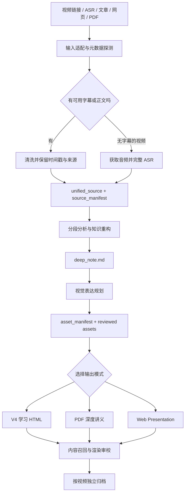

# Video Study Pipeline

<div align="center">

**把长视频变成可阅读、可检索、可回溯原片的多模态学习材料。**

Source-backed video study notes for Bilibili, YouTube, transcripts, articles, webpages, and PDFs.


</div>

> 这不是“字幕摘要器”。它先保留字幕、时间戳、关键帧和来源关系，再进行知识重构、视觉规划和多端渲染；读者既能快速阅读，也能从任意重点跳回原片核对。

## 目录

- [为什么需要它](#为什么需要它)
- [最终能得到什么](#最终能得到什么)
- [30 秒开始使用](#30-秒开始使用)
- [核心能力](#核心能力)
- [工作流程](#工作流程)
- [安装](#安装)
- [运行环境](#运行环境)
- [使用示例](#使用示例)
- [输出与目录](#输出与目录)
- [质量与隐私](#质量与隐私)
- [故障排查](#故障排查)
- [开发与验证](#开发与验证)
- [项目状态与许可证](#项目状态与许可证)

## 为什么需要它

普通视频总结通常只保留几个结论，代价是丢失论证过程、例子、边界条件和画面证据。Video Study Pipeline 的目标不同：

- **更快学习**：把线性视频重构为适合扫读和精读的 Blog 型讲义。
- **少丢信息**：保留机制、例子、反例、公式、代码、时间戳和来源锚点，而不只列摘要。
- **图文协同**：在正文需要的位置加入关键帧、Mermaid 架构图、表格、公式和代码块。
- **随时回溯**：HTML 中的原片入口、章节定位和字幕让结论可以被核对。
- **一份内容，多种交付**：同一来源可以输出 HTML、PDF、Presentation，或任意组合。

它适合课程、访谈、播客、技术分享、行业分析和长篇知识视频，也可以接收已有 ASR、演讲稿、会议记录、文章、网页或 PDF。

## 最终能得到什么

### V4 多模态学习 HTML

默认推荐的阅读形态，适合替代大部分“先完整看一遍视频”的场景：

- Blog 型正文，不是逐段转述或固定模板摘要。
- 关键帧、Mermaid、表格、公式和代码按语义嵌入正文。
- 左侧阅读路径、全文搜索、书签、阅读进度和本地个人笔记。
- 本地播放器支持定位回放、前后 10 秒、倍速、音量、全屏和专注模式。
- `整理字幕` 与 `逐字字幕` 两种模式，可在理解和核对之间切换。
- 章节时间用于阅读定位，每章默认只保留一个最强原片证据入口，避免重复播放按钮。

### PDF 深度讲义

适合打印、归档和离线批注。可选择：

- DeepNote 文章式 PDF。
- DeepNote LaTeX PDF。
- 与 `wdkns` 官方逻辑兼容的 LaTeX 课程讲义。

### Web Presentation

适合演示或录屏的 16:9 网页。它会重新组织叙事、场景与视觉资产，而不是把长文分页复制过去。

### 可审计的中间资产

每次运行会保留可继续加工的内容底座：

- `unified_source.md`：清洗后的统一源材料。
- `source_manifest.json`：提取方式、来源与限制。
- `deep_note.md`：Blog 型知识重构稿。
- `asset_manifest.json`：封面、关键帧、图表和视觉用途。
- renderer brief：每种输出独立的组织与视觉计划。

## 30 秒开始使用

安装完成后，在新的 Agent 任务中输入：

```text
使用 $video-study-pipeline 解读这个视频，只输出 HTML：
https://www.bilibili.com/video/BVxxxxxxxxxx
```

也可以直接指定组合输出：

```text
使用 $video-study-pipeline 深度解读这个 YouTube 视频，输出 HTML + PDF。
没有可用字幕时先完整 ASR，再写讲义；关键帧按默认策略自动选择。
https://www.youtube.com/watch?v=xxxxxxxxxxx
```

默认交付到：

```text
~/Downloads/视频解读/<video-id>-<video-title>/
```

## 核心能力

| 能力 | 具体行为 |
| --- | --- |
| 来源获取 | 识别 Bilibili / YouTube 链接、分 P、字幕、封面与时长；无字幕时按配置进入 ASR。 |
| 知识重构 | 将长材料写成连贯的 Blog 型讲义，保留机制、例子、边界与迁移场景。 |
| 视觉规划 | 对比优先表格，流程与架构优先 Mermaid，原始画面证据使用经过检查的关键帧。 |
| 来源回溯 | 通过时间戳、字幕和 source clip 把讲义结论连接回原视频。 |
| 多渲染器 | HTML、PDF、Presentation 各自拥有独立的内容组织、视觉密度与质量门禁。 |
| 本地交付 | 产物、字幕、音视频与运行资产默认保存在本机，不进入本仓库。 |
| 质量审校 | 检查 DeepNote 风格、资产消费、坏图、字幕覆盖、播放器结构和 PDF 渲染。 |

## 工作流程



关键设计原则：

1. `deep_note.md` 是统一内容底座，不是最终成品。
2. `asset_manifest.json` 是视觉与证据契约，不是读者要看的“资产附录”。
3. HTML、PDF、Presentation 必须分别增强，禁止仅做格式转换。
4. 任何重要结论都应尽可能保留来源锚点；无法从材料支持的内容不应被补造。

## 安装

仓库内真正的 Skill 位于 `video-study-pipeline/`，不要只复制根目录 README。

### OpenAI Codex

推荐使用 Codex 自带的 Skill 安装器：

```bash
python3 \
  "${CODEX_HOME:-$HOME/.codex}/skills/.system/skill-installer/scripts/install-skill-from-github.py" \
  --repo cdy1206/video-study-pipeline \
  --path video-study-pipeline \
  --method git
```

然后重新打开 Codex 任务，使用 `$video-study-pipeline`。

如果安装器不可用，可以手动安装：

```bash
tmpdir="$(mktemp -d)"
git clone --depth 1 https://github.com/cdy1206/video-study-pipeline.git "$tmpdir/repo"
mkdir -p "${CODEX_HOME:-$HOME/.codex}/skills/video-study-pipeline"
cp -R "$tmpdir/repo/video-study-pipeline/." \
  "${CODEX_HOME:-$HOME/.codex}/skills/video-study-pipeline/"
```

### Claude Code

Claude Code 支持 Agent Skills 目录结构。安装为个人 Skill：

```bash
tmpdir="$(mktemp -d)"
git clone --depth 1 https://github.com/cdy1206/video-study-pipeline.git "$tmpdir/repo"
mkdir -p "$HOME/.claude/skills/video-study-pipeline"
cp -R "$tmpdir/repo/video-study-pipeline/." \
  "$HOME/.claude/skills/video-study-pipeline/"
```

在新会话中可直接说明使用 `video-study-pipeline`，或尝试 `/video-study-pipeline`。目录兼容不代表所有 Codex 专用工具在 Claude Code 中都有同名实现；缺失能力会按 `SKILL.md` 的回退规则处理。

### Cursor

Cursor 可从 `.cursor/skills`、`.agents/skills` 等目录发现 Agent Skills。个人安装示例：

```bash
tmpdir="$(mktemp -d)"
git clone --depth 1 https://github.com/cdy1206/video-study-pipeline.git "$tmpdir/repo"
mkdir -p "$HOME/.cursor/skills/video-study-pipeline"
cp -R "$tmpdir/repo/video-study-pipeline/." \
  "$HOME/.cursor/skills/video-study-pipeline/"
```

若只想在一个项目中使用，将同一目录复制到：

```text
<project>/.cursor/skills/video-study-pipeline/
```

### 其他 AI 编程工具

如果客户端原生支持 Agent Skills，将 `video-study-pipeline/` 放入它规定的 Skill 目录。如果不支持，可以让 Agent 先读取 `video-study-pipeline/SKILL.md`，再按其中的 references 与 scripts 执行。后者属于手动兼容模式，不保证客户端具备浏览器、ASR、LaTeX 或本地文件预览能力。

### 更新

安装器不会覆盖同名 Skill。更新前先做可恢复备份：

```bash
skill_dir="${CODEX_HOME:-$HOME/.codex}/skills/video-study-pipeline"
mv "$skill_dir" "$skill_dir.backup.$(date +%Y%m%d-%H%M%S)"

python3 \
  "${CODEX_HOME:-$HOME/.codex}/skills/.system/skill-installer/scripts/install-skill-from-github.py" \
  --repo cdy1206/video-study-pipeline \
  --path video-study-pipeline \
  --method git
```

Claude Code 或 Cursor 的手动安装可以采用相同的“先改名备份，再复制新版”策略。

## 运行环境

### 最低要求

- Git
- Python 3
- 能运行 Agent Skills 的 AI 编程客户端

### 按输入和输出按需安装

| 工具 | 何时需要 |
| --- | --- |
| `yt-dlp` | 下载平台字幕、音频或视频流。 |
| `ffmpeg` / `ffprobe` | 音视频探测、抽帧、转码和 ASR 音频准备。 |
| ASR 后端 | 平台无可用字幕且需要完整转写时。可以是 Whisper 或其他可输出时间戳的服务。 |
| Node.js | V3/V4 HTML 数据组装与渲染脚本。 |
| Chromium / Chrome | 本地 HTML 验收、打印 PDF 或自动化截图。 |
| LaTeX | 选择 LaTeX PDF 路线时。 |

快速检查：

```bash
python3 --version
node --version
ffmpeg -version
yt-dlp --version
```

缺少某个可选依赖时，Skill 应先报告具体缺口，再选择有证据的回退路线；不能把“没有字幕”直接当作“无法解读”。

## 使用示例

### 只输出 HTML

```text
使用 $video-study-pipeline 解读这个视频，只输出 HTML。
按默认策略自动抽帧；正文要有表格、Mermaid 和来源回溯。
<video-url>
```

### HTML + PDF

```text
使用 $video-study-pipeline 深度解读这个视频，输出 HTML + PDF。
PDF 使用 DeepNote LaTeX 路线，HTML 使用 V4 多模态学习页。
<video-url>
```

### Presentation only

```text
使用 $video-study-pipeline 解读这个视频，只输出 Presentation。
先生成 storyboard，再按 16:9 场景重组，不要把长文直接分页。
<video-url>
```

### 自己选择全部选项

```text
使用 $video-study-pipeline 解读这个视频，我要自己选择全部选项。
请在每个真正需要决策的阶段再问我，不要一次问完。
<video-url>
```

### 复用已有字幕或 DeepNote

```text
使用 $video-study-pipeline 处理这个本地目录。
复用已有字幕和视频资产，从 deep_note.md 开始重新生成 HTML。
<local-folder>
```

## 输出与目录

推荐的最终目录：

```text
~/Downloads/视频解读/
└── <video-id>-<safe-title>/
    ├── <safe-title>.html
    ├── <safe-title>.pdf                 # 仅在选择 PDF 时
    ├── <safe-title>-presentation.html   # 仅在选择 Presentation 时
    ├── deep_note.md
    ├── metadata.json
    ├── assets/
    │   ├── asset_manifest.json
    │   ├── cover.*
    │   ├── keyframes/
    │   ├── diagrams/
    │   ├── subtitles/
    │   └── media/                       # 可选，本地源视频/音频
    └── presentation/                    # 可选，演示工程
```

仓库自身结构：

```text
video-study-pipeline/
├── SKILL.md                    # 端到端规则与决策边界
├── agents/openai.yaml          # Codex UI 元数据
├── assets/                     # HTML/CSS/JS 与 LaTeX 模板
├── references/                 # 写作、视觉、渲染与质量规范
└── scripts/                    # 校验、组装、渲染与打包工具
```

## 质量与隐私

### 内容质量

- 不允许从标题、评论、弹幕或封面直接生成所谓深度讲义。
- 视频无可用字幕时，必须先尝试获得音频并完成带时间戳 ASR，或明确说明阻塞原因。
- DeepNote 必须是语义重写，不允许用正则替换、通用填充句或机械扩写凑字数。
- 短小节只能补充来源支持的机制、例子、反例和迁移场景；没有材料就保持简洁。
- 关键帧需要经过视觉检查；普通 talking-head、重复画面和不可读字幕帧应被跳过。
- Mermaid、表格和图片必须服务于相邻论述，不能集中成独立“资产展示章”。

### 渲染质量

- HTML 必须能本地打开，不得出现坏图、原始 Mermaid 代码或播放器空白占位。
- 双字幕、倍速、跳转、音量、全屏、关闭和专注模式需要通过结构与交互检查。
- PDF 不仅要编译成功，还要检查页数、文本、嵌图、分页和代表页面截图。
- Presentation 的图片、表格和图表必须进入有边界的 16:9 布局，不能按原尺寸随意粘贴。

### 隐私边界

本仓库不应包含：

- 原始视频、音频、字幕或 ASR 产物。
- Bilibili / YouTube Cookies 或浏览器登录信息。
- API Key、`.env`、账号凭据或私有下载地址。
- 用户笔记、运行日志、历史生成目录或本地绝对路径。

提交前请检查：

```bash
git status --short
git diff --check
git grep -nE '(API_KEY|COOKIE|Authorization:|/Users/)' -- . ':!README.md'
```

## 故障排查

### 安装后找不到 Skill

1. 确认路径为 `<skills-root>/video-study-pipeline/SKILL.md`，中间没有多套一层仓库目录。
2. 重新打开一个 Agent 会话；部分客户端只在会话启动时扫描 Skills。
3. 明确输入 `$video-study-pipeline` 或让 Agent 先读取该 `SKILL.md`。

### Codex 安装器提示 `CERTIFICATE_VERIFY_FAILED`

这是 Python 本地证书链问题，不代表仓库不可访问。README 的推荐命令已经使用 `--method git`，会通过系统 Git 克隆并绕开 Python ZIP 下载路径。先确认：

```bash
git ls-remote https://github.com/cdy1206/video-study-pipeline.git HEAD
```

如果该命令可以返回 commit hash，重新执行带 `--method git` 的安装命令即可。

### 视频没有字幕

这不等于任务结束。依次检查：

1. 平台字幕或 uploader 字幕是否存在。
2. `yt-dlp` 是否能取得音频流。
3. Cookie、地区、版权或登录限制是否阻止下载。
4. 是否已配置可输出时间戳的 ASR 后端。

若音频也无法取得，应保留实际命令和错误信息，而不是用元数据猜测内容。

### 本地 HTML 打开后空白

最终 HTML 应尽可能兼容 `file://`。如果浏览器安全策略仍阻止资源加载，可在产物目录启动本地服务器：

```bash
python3 -m http.server 8765
```

然后打开 `http://localhost:8765/`。如果 HTTP 可用而 `file://` 不可用，应继续检查是否仍有外部模块、绝对路径或未内联资源。

### 图片被裁切、过大或留白

- 检查图片自然比例与 renderer 中的 `ratio` / `object-fit`。
- 正文图应有最大宽高和边界容器，不应默认占满整页。
- 关键帧、结构图和对比表应按各自用途使用不同布局。
- 通过真实浏览器截图验收，不能只凭 DOM 或构建成功判断。

### PDF 中出现 Mermaid 源代码

PDF 路线必须先把 Mermaid 渲染为 SVG/PDF/PNG 等视觉资产，再插入文档。最终 PDF 出现 `flowchart TD` 表示渲染门禁失败。

## 开发与验证

克隆仓库：

```bash
git clone https://github.com/cdy1206/video-study-pipeline.git
cd video-study-pipeline
```

运行 Skill 结构校验：

```bash
python3 \
  "${CODEX_HOME:-$HOME/.codex}/skills/.system/skill-creator/scripts/quick_validate.py" \
  video-study-pipeline
```

运行 DeepNote checker 测试：

```bash
python3 video-study-pipeline/scripts/test_check_deep_note_blog_style.py
```

运行 Python 语法检查：

```bash
python3 -m py_compile video-study-pipeline/scripts/*.py
```

贡献时请保持以下边界：

- 一个 PR 解决一个清晰问题。
- 新增规则要说明它防止了什么真实失败，而不是继续堆叠模板句。
- 修改 renderer 时同时补充结构检查或最小复现样例。
- 不提交受版权保护的视频媒体、账号凭据和个人生成产物。

## 项目状态与许可证

当前版本以 **视频输入 + V4 多模态学习 HTML** 为最成熟主路径；PDF、Presentation 和非视频输入已经纳入统一架构，但实际效果仍依赖本机工具链与来源质量。

本仓库目前**尚未包含明确的开源许可证**。在许可证文件加入之前，默认版权规则仍然适用；这意味着公开可见不等于获得复制、修改、分发或商业使用授权。如果你希望在自己的项目中分发或商用，请先通过 GitHub Issue 联系仓库所有者确认授权。

---

如果这个项目解决了你的长视频学习问题，可以提交 Issue 说明你的输入类型、期望输出和失败样例。真实案例比继续增加抽象选项更有助于改进流水线。
