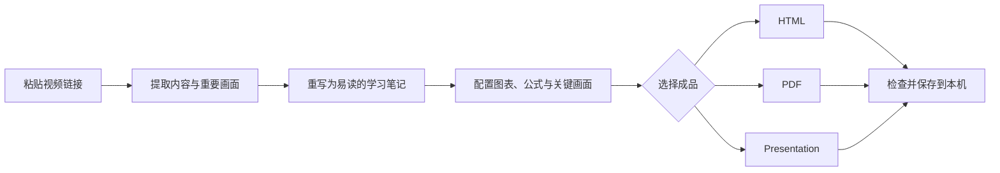

# Video Study Pipeline

<div align="center">

## 把收藏夹里的长视频，变成真正看得完的学习笔记

粘贴一个 B 站或 YouTube 链接，得到图文并茂、可以搜索、还能随时跳回原片核对的学习页面。


[](LICENSE)

[查看效果](#实际效果) · [30 秒上手](#30-秒发起第一次解读) · [常用指令](#常用指令)

</div>

> 稍后再看越存越多，但一两个小时的视频总抽不出时间看完？先读一份结构清楚的图文笔记；遇到重要或没看懂的地方，再一键回到对应视频片段。

## 你可能正需要它

- 收藏了公开课、访谈或知识视频，却一直没有时间完整观看。
- 看完视频很快就忘，希望留下以后能搜索、复习和批注的笔记。
- 技术视频里有公式、代码、架构和对比关系，只看几条摘要根本不够。
- 不想盲信总结，需要随时回到原片确认上下文。

Video Study Pipeline 不是把视频压缩成几条结论。它会重新组织论证、例子和边界条件，并把关键画面、关系图、表格、公式或代码放到真正需要的位置。

## 实际效果

<p align="center">
  
</p>

<p align="center"><sub>先用一屏判断这个视频值不值得精读，再进入正文或返回原片。</sub></p>

<table>
  <tr>
    <td width="50%">
      
      <br><sub><b>图文精读</b>：正文、关键画面和结构图在同一条阅读路径里。</sub>
    </td>
    <td width="50%">
      
      <br><sub><b>原片回溯</b>：看不懂或想确认时，直接播放对应片段。</sub>
    </td>
  </tr>
</table>

## 30 秒发起第一次解读

### 1. 安装 Skill

在终端运行：

```bash
python3 \
  "${CODEX_HOME:-$HOME/.codex}/skills/.system/skill-installer/scripts/install-skill-from-github.py" \
  --repo cdy1206/video-study-pipeline \
  --path video-study-pipeline \
  --method git
```

### 2. 粘贴视频链接

重新打开一个 Codex 任务，发送：

```text
使用 $video-study-pipeline 解读这个视频，只输出 HTML：
https://www.bilibili.com/video/BVxxxxxxxxxx
```

B 站普通链接、BV 号和“稍后再看”链接都可以直接粘贴。

首次处理 B 站视频，建议先在这台电脑的 Edge、Chrome 或 Firefox 登录并确认能正常播放，再告诉 AI 使用哪个浏览器。客户端需要能在本机运行命令；如果它只在云端运行，请先提供本地视频或字幕。具体操作见 [视频获取说明](video-study-pipeline/references/source-acquisition.md)。

### 3. 打开成品

完成后，打开生成的 `.html` 文件即可阅读：

```text
~/Downloads/视频解读/<video-id>-<video-title>/<video-title>.html
```

这一步只是**发起任务**需要约 30 秒；实际生成时间会随视频时长、内容密度和所选输出而变化。

## 最终能得到什么

### HTML：最适合日常学习

- 把视频重写成连贯的图文文章，而不是逐句转述。
- 重要画面、关系图、表格、公式和代码出现在对应正文旁边。
- 支持目录、全文搜索、书签、阅读进度和本地个人笔记。
- 点击重点内容即可回到原片对应位置。
- 本地播放器支持前后 10 秒、倍速、音量、全屏和专注模式。

### PDF：适合打印和归档

- 保留正文中的图片、图表、公式和章节结构。
- 适合平板批注、打印复习或长期保存。
- 只有明确要求 PDF 时才会生成。

### Presentation：适合汇报和录屏

- 输出 16:9 的网页演示页。
- 根据内容重新组织场景和视觉节奏，不是把长文章机械分页。
- 适合课堂分享、读书会和复习汇报。

三种成品可以单独选择，也可以组合生成。

## 常用指令

不需要记参数，直接用自然语言说明想要什么。

### 平时阅读：只要 HTML

```text
使用 $video-study-pipeline 解读这个 B 站视频，只输出 HTML。
<video-url>
```

### 阅读并保存：HTML + PDF

```text
使用 $video-study-pipeline 深度解读这个视频，输出 HTML + PDF。
<video-url>
```

### 准备分享：只要 Presentation

```text
使用 $video-study-pipeline 解读这个视频，只输出 Presentation。
<video-url>
```

### 想自己决定风格和输出

```text
使用 $video-study-pipeline 解读这个视频，我要自己选择全部选项。
请在真正需要决定时再问我，不要一次问完。
<video-url>
```

## 为什么它不只是“视频摘要”

| 普通摘要 | Video Study Pipeline |
| --- | --- |
| 只保留几条结论 | 保留论证、例子、反例和适用边界 |
| 文字和画面分离 | 关键画面、图表和公式放在对应正文旁边 |
| 看完无法核对来源 | 重点内容可以返回原片对应位置 |
| 生成后只能从头读 | 支持目录、搜索、书签、进度和个人笔记 |
| 所有输出只是换格式 | HTML、PDF 和 Presentation 分别适配阅读、打印与演示 |

## 从视频到笔记



## 支持范围

| 输入 | 支持情况 |
| --- | --- |
| Bilibili 视频、BV 号、稍后再看链接 | 主要支持路径 |
| YouTube 视频链接 | 主要支持路径 |
| 演讲稿、会议记录和长文本 | 支持 |
| 文章、网页和 PDF | 支持，实际效果取决于原材料结构 |

视频输入和 HTML 图文笔记是目前最成熟的组合。PDF、Presentation 和非视频输入也已纳入同一流程，但效果仍会受到来源质量与本机工具环境影响。

## 安装到其他客户端

### OpenAI Codex

推荐使用上方 [30 秒上手](#30-秒发起第一次解读) 中的安装命令。如果安装器不可用，可以手动安装：

```bash
tmpdir="$(mktemp -d)"
git clone --depth 1 https://github.com/cdy1206/video-study-pipeline.git "$tmpdir/repo"
mkdir -p "${CODEX_HOME:-$HOME/.codex}/skills/video-study-pipeline"
cp -R "$tmpdir/repo/video-study-pipeline/." \
  "${CODEX_HOME:-$HOME/.codex}/skills/video-study-pipeline/"
```

<details>
<summary><b>Claude Code 安装方式</b></summary>

```bash
tmpdir="$(mktemp -d)"
git clone --depth 1 https://github.com/cdy1206/video-study-pipeline.git "$tmpdir/repo"
mkdir -p "$HOME/.claude/skills/video-study-pipeline"
cp -R "$tmpdir/repo/video-study-pipeline/." \
  "$HOME/.claude/skills/video-study-pipeline/"
```

安装后，在新会话中说明使用 `video-study-pipeline`，或尝试 `/video-study-pipeline`。

</details>

<details>
<summary><b>Cursor 安装方式</b></summary>

```bash
tmpdir="$(mktemp -d)"
git clone --depth 1 https://github.com/cdy1206/video-study-pipeline.git "$tmpdir/repo"
mkdir -p "$HOME/.cursor/skills/video-study-pipeline"
cp -R "$tmpdir/repo/video-study-pipeline/." \
  "$HOME/.cursor/skills/video-study-pipeline/"
```

只在某个项目中使用时，也可以复制到：

```text
<project>/.cursor/skills/video-study-pipeline/
```

</details>

<details>
<summary><b>其他支持 Agent Skills 的工具</b></summary>

将仓库中的 `video-study-pipeline/` 目录放入客户端规定的 Skill 目录。若客户端不支持自动发现 Skill，可以让 Agent 先读取 `video-study-pipeline/SKILL.md`，再按其中说明执行。不同客户端能够调用的本地工具可能不同。

</details>

### 更新

安装器不会覆盖同名 Skill。更新前先做备份：

```bash
skill_dir="${CODEX_HOME:-$HOME/.codex}/skills/video-study-pipeline"
mv "$skill_dir" "$skill_dir.backup.$(date +%Y%m%d-%H%M%S)"

python3 \
  "${CODEX_HOME:-$HOME/.codex}/skills/.system/skill-installer/scripts/install-skill-from-github.py" \
  --repo cdy1206/video-study-pipeline \
  --path video-study-pipeline \
  --method git
```

## 运行要求

最低要求：

- Git
- Python 3
- 能运行 Agent Skills 的 AI 编程客户端

根据视频来源和所选成品，运行时可能还会使用 `yt-dlp`、`ffmpeg`、Node.js 或 Chromium。缺少依赖时，Skill 会先说明需要安装什么；完整说明见 [使用说明](docs/quality-and-troubleshooting.md)。

## 文件保存位置

每个视频单独一个文件夹，文件名使用视频标题：

```text
~/Downloads/视频解读/
└── <video-id>-<video-title>/
    ├── <video-title>.html                 # 选择 HTML 时
    ├── <video-title>.pdf                  # 选择 PDF 时
    └── <video-title>-presentation.html    # 选择 Presentation 时
```

## 许可证

本仓库由项目作者创作的代码和文档采用 [MIT License](LICENSE)，允许使用、修改、分发和商业使用，但需要保留版权声明和许可证文本。

README 效果图中出现的第三方视频画面、封面、平台标识及其他源媒体不包含在 MIT 授权范围内，其相关权利仍归原权利人所有。

---

如果它帮你消化了一条原本没时间看的长视频，欢迎 Star。遇到无法正常处理的视频，也可以提交 Issue，并附上视频链接、期望输出和实际结果。
