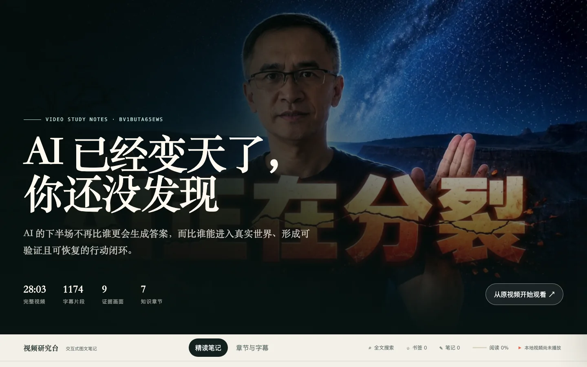
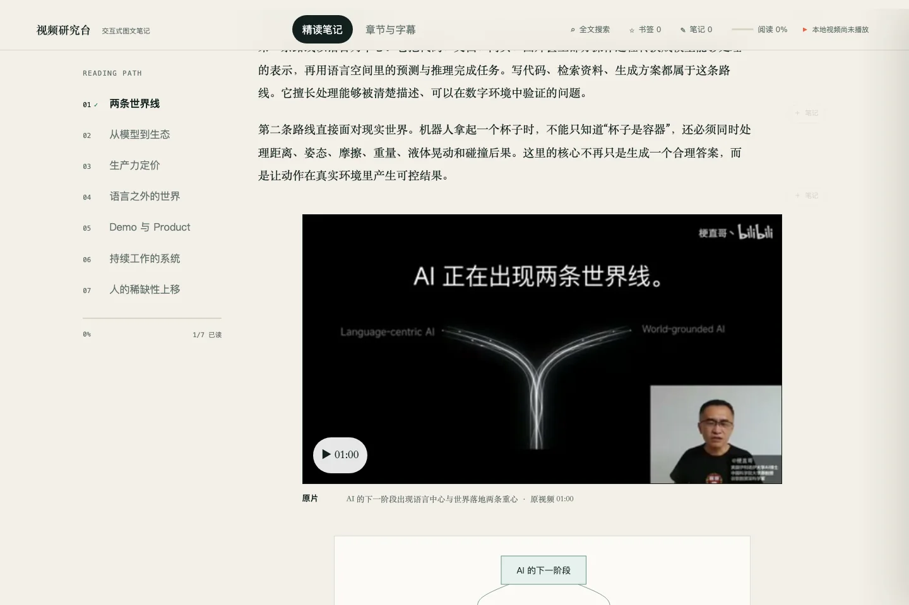
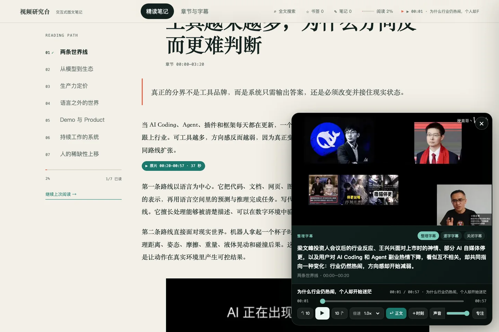
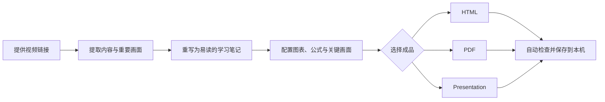

# Video Study Pipeline

<div align="center">

**把长视频变成一份能快速读懂、随时查证、方便复习的图文笔记。**

Turn long videos into illustrated notes, printable PDFs, and presentation-ready pages.


[](LICENSE)

</div>

> 这不是只列几条结论的摘要器。它会保留重要论证、例子和画面，再把视频整理成一份能快速阅读、方便复习、也能随时回到原片核对的学习笔记。

## 目录

- [为什么需要它](#为什么需要它)
- [效果预览](#效果预览)
- [最终能得到什么](#最终能得到什么)
- [30 秒开始使用](#30-秒开始使用)
- [核心能力](#核心能力)
- [工作流程](#工作流程)
- [安装](#安装)
- [运行环境](#运行环境)
- [使用示例](#使用示例)
- [文件保存位置](#文件保存位置)
- [项目状态与许可证](#项目状态与许可证)

## 为什么需要它

普通视频总结通常只保留几个结论，代价是丢失论证过程、例子、边界条件和画面证据。Video Study Pipeline 的目标不同：

- **更快学习**：把线性视频重构为适合扫读和精读的长文笔记。
- **少丢信息**：保留机制、例子、反例、公式、代码、时间戳和来源锚点，而不只列摘要。
- **图文协同**：在正文需要的位置加入关键帧、Mermaid 架构图、表格、公式和代码块。
- **随时回溯**：HTML 中的原片入口和章节定位让重要内容可以被核对。
- **一份内容，多种交付**：同一来源可以输出交互式图文笔记、打印版或演示页，也可以自由组合。

它适合课程、访谈、播客、技术分享、行业分析和长篇知识视频，也可以处理演讲稿、会议记录、文章、网页或 PDF。

## 效果预览

<p align="center">
  
</p>

<p align="center"><sub>先用一屏说明视频在讲什么，再决定精读正文或返回原片。</sub></p>

<table>
  <tr>
    <td width="50%">
      
      <br><sub><b>图文精读</b>：画面和结构图放在它们真正解释的段落旁边。</sub>
    </td>
    <td width="50%">
      
      <br><sub><b>原片回溯</b>：遇到疑问，直接查看对应视频片段。</sub>
    </td>
  </tr>
</table>

## 最终能得到什么

### 交互式图文笔记（HTML）

默认推荐的阅读形态，适合替代大部分“先完整看一遍视频”的场景：

- 正文按文章逻辑重新组织，不是逐段转述或固定模板摘要。
- 关键画面、关系图、表格、公式和代码放在真正需要它们的位置。
- 左侧阅读路径、全文搜索、书签、阅读进度和本地个人笔记。
- 本地播放器支持定位回放、前后 10 秒、倍速、音量、全屏和专注模式。
- 点击重点段落即可回到原片对应位置，快速核对上下文。

### 打印版学习笔记（PDF）

适合打印、归档和离线批注，保留正文中的关键图片、图表、公式与章节结构。

### 演示页（Presentation）

适合演示或录屏的 16:9 网页。它会重新组织叙事、场景与视觉资产，而不是把长文分页复制过去。

## 30 秒开始使用

### 1. 安装

在终端运行：

```bash
python3 \
  "${CODEX_HOME:-$HOME/.codex}/skills/.system/skill-installer/scripts/install-skill-from-github.py" \
  --repo cdy1206/video-study-pipeline \
  --path video-study-pipeline \
  --method git
```

### 2. 开始使用

重新打开一个 Codex 任务，直接输入：

```text
使用 $video-study-pipeline 解读这个视频，只输出 HTML：
https://www.bilibili.com/video/BVxxxxxxxxxx
```

完成后可以在这里找到成品：

```text
~/Downloads/视频解读/<video-id>-<video-title>/
```

## 核心能力

| 能力 | 具体行为 |
| --- | --- |
| 快速读懂 | 把线性视频重写为可扫读、可精读的文章，保留机制、例子、边界与可迁移方法。 |
| 图文解释 | 对比内容用表格，流程与架构用关系图，重要画面放在对应正文旁边。 |
| 回到原片 | 点击重点内容即可播放对应片段，不必重新拖动整段视频寻找上下文。 |
| 三种成品 | 可单独或组合输出 HTML、PDF 和 Presentation。 |
| 本地使用 | 成品默认保存在本机，断网后仍可阅读已经生成的文件。 |
| 自动检查 | 交付前检查文章结构、图文关系、坏图、播放器和打印效果。 |

## 工作流程



## 安装

仓库内真正的 Skill 位于 `video-study-pipeline/`，不要只复制根目录 README。

### OpenAI Codex

推荐使用 Codex 自带的 Skill 安装器：

```bash
python3 \
  "${CODEX_HOME:-$HOME/.codex}/skills/.system/skill-installer/scripts/install-skill-from-github.py" \
  --repo cdy1206/video-study-pipeline \
  --path video-study-pipeline \
  --method git
```

然后重新打开 Codex 任务，使用 `$video-study-pipeline`。

如果安装器不可用，可以手动安装：

```bash
tmpdir="$(mktemp -d)"
git clone --depth 1 https://github.com/cdy1206/video-study-pipeline.git "$tmpdir/repo"
mkdir -p "${CODEX_HOME:-$HOME/.codex}/skills/video-study-pipeline"
cp -R "$tmpdir/repo/video-study-pipeline/." \
  "${CODEX_HOME:-$HOME/.codex}/skills/video-study-pipeline/"
```

### Claude Code

Claude Code 支持 Agent Skills 目录结构。安装为个人 Skill：

```bash
tmpdir="$(mktemp -d)"
git clone --depth 1 https://github.com/cdy1206/video-study-pipeline.git "$tmpdir/repo"
mkdir -p "$HOME/.claude/skills/video-study-pipeline"
cp -R "$tmpdir/repo/video-study-pipeline/." \
  "$HOME/.claude/skills/video-study-pipeline/"
```

在新会话中可直接说明使用 `video-study-pipeline`，或尝试 `/video-study-pipeline`。目录兼容不代表所有 Codex 专用工具在 Claude Code 中都有同名实现；缺失能力会按 `SKILL.md` 的回退规则处理。

### Cursor

Cursor 可从 `.cursor/skills`、`.agents/skills` 等目录发现 Agent Skills。个人安装示例：

```bash
tmpdir="$(mktemp -d)"
git clone --depth 1 https://github.com/cdy1206/video-study-pipeline.git "$tmpdir/repo"
mkdir -p "$HOME/.cursor/skills/video-study-pipeline"
cp -R "$tmpdir/repo/video-study-pipeline/." \
  "$HOME/.cursor/skills/video-study-pipeline/"
```

若只想在一个项目中使用，将同一目录复制到：

```text
<project>/.cursor/skills/video-study-pipeline/
```

### 其他 AI 编程工具

如果客户端原生支持 Agent Skills，将 `video-study-pipeline/` 放入它规定的 Skill 目录。如果不支持，可以让 Agent 先读取 `video-study-pipeline/SKILL.md`，再按其中的说明执行。不同客户端支持的功能可能有所不同。

### 更新

安装器不会覆盖同名 Skill。更新前先做可恢复备份：

```bash
skill_dir="${CODEX_HOME:-$HOME/.codex}/skills/video-study-pipeline"
mv "$skill_dir" "$skill_dir.backup.$(date +%Y%m%d-%H%M%S)"

python3 \
  "${CODEX_HOME:-$HOME/.codex}/skills/.system/skill-installer/scripts/install-skill-from-github.py" \
  --repo cdy1206/video-study-pipeline \
  --path video-study-pipeline \
  --method git
```

Claude Code 或 Cursor 的手动安装可以采用相同的“先改名备份，再复制新版”策略。

## 运行环境

### 最低要求

- Git
- Python 3
- 能运行 Agent Skills 的 AI 编程客户端

根据视频来源和选择的成品，运行时可能还会使用 `yt-dlp`、`ffmpeg`、Node.js 或 Chromium。缺少依赖时，Skill 会先说明需要安装什么；完整环境说明见 [使用说明](docs/quality-and-troubleshooting.md)。

## 使用示例

### 只输出 HTML

```text
使用 $video-study-pipeline 解读这个视频，只输出 HTML。
<video-url>
```

### HTML + PDF

```text
使用 $video-study-pipeline 深度解读这个视频，输出 HTML + PDF。
<video-url>
```

### Presentation only

```text
使用 $video-study-pipeline 解读这个视频，只输出 Presentation。
<video-url>
```

### 自己选择全部选项

```text
使用 $video-study-pipeline 解读这个视频，我要自己选择全部选项。
请在每个真正需要决策的阶段再问我，不要一次问完。
<video-url>
```

## 文件保存位置

推荐的最终目录：

```text
~/Downloads/视频解读/
└── <video-id>-<video-title>/
    ├── <video-title>.html                 # 选择 HTML 时
    ├── <video-title>.pdf                  # 选择 PDF 时
    └── <video-title>-presentation.html    # 选择 Presentation 时
```

## 项目状态与许可证

当前版本以 **视频输入 + 交互式图文笔记** 为最成熟主路径；PDF、演示网页和非视频输入已经纳入统一架构，但实际效果仍依赖本机工具链与来源质量。

除非另有说明，本仓库由项目作者创作的代码和文档采用 [MIT License](LICENSE)，允许使用、修改、分发和商业使用，但需要保留版权声明和许可证文本。

README 效果图中出现的第三方视频画面、封面、平台标识及其他源媒体不包含在 MIT 授权范围内，其相关权利仍归原权利人所有。

---

如果这个项目解决了你的长视频学习问题，可以提交 Issue 说明你的输入类型、期望输出和失败样例。真实案例比继续增加抽象选项更有助于改进流水线。
